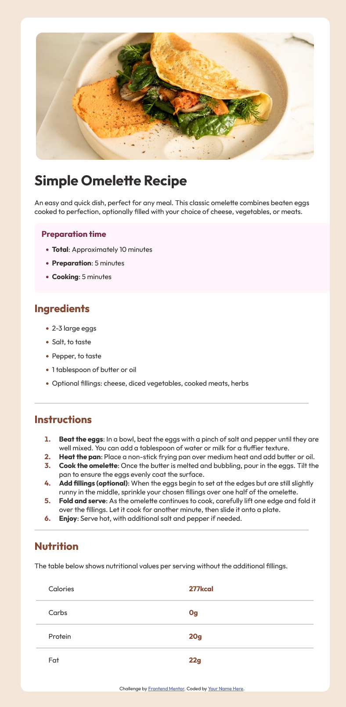

# Frontend Mentor - Recipe page solution

This is a solution to the [Recipe page challenge on Frontend Mentor](https://www.frontendmentor.io/challenges/recipe-page-KiTsR8QQKm). Frontend Mentor challenges help you improve your coding skills by building realistic projects. 

## Table of contents

- [Overview](#overview)
  - [The challenge](#the-challenge)
  - [Screenshot](#screenshot)
  - [Links](#links)
- [My process](#my-process)
  - [Built with](#built-with)
  - [What I learned](#what-i-learned)
  - [Continued development](#continued-development)
  - [Useful resources](#useful-resources)
- [Author](#author)
- [Acknowledgments](#acknowledgments)

**Note: Delete this note and update the table of contents based on what sections you keep.**

## Overview

### Screenshot



### Links

- Solution URL: [Add solution URL here](https://your-solution-url.com)
- Live Site URL: [https://mateusb12.github.io/frontend-mentor-recipe-page-main/](https://your-live-site-url.com)

## My process

### Built with

- Semantic HTML5 markup
- CSS custom properties
- Flexbox

### What I learned

`rem` units are based on the root element's font-size. By setting font-size in the CSS `:root` selector, I can adjust 
the sizing of all elements using rem units just by changing one value

```css
:root {
    font-size: 16px;
}
```

`em` units are based on the font-size of the element itself. This makes `em` units great for `.padding` and `.margin` properties, as they will scale with the font-size of the element
```css
.element {
  font-size: 20px;
  padding: 1em;  /* padding will be 20px */
  margin: 0.5em; /* margin will be 10px */
}
```

The element `<hr>` is useful for creating a horizontal line.

```css
hr {
  border: none;
  border-top: 2px solid #b7b9ff;
}
```

I can use `::marker` property to style the bullet points of a list

```css
ul::marker {
  color: #b7b9ff;
}
```

Sometimes overwriting margin values will not work. In this cases I should use negative values
```css
.element{
  margin-left: -2rem !important;
}
```

In order to set the margin between flex elements I should go for each child and set the `flex` value
```css
.flex-children{
    flex: 1;
}
```


### Continued development

Use this section to outline areas that you want to continue focusing on in future projects. These could be concepts you're still not completely comfortable with or techniques you found useful that you want to refine and perfect.

**Note: Delete this note and the content within this section and replace with your own plans for continued development.**

### Useful resources

- [Example resource 1](https://www.example.com) - This helped me for XYZ reason. I really liked this pattern and will use it going forward.
- [Example resource 2](https://www.example.com) - This is an amazing article which helped me finally understand XYZ. I'd recommend it to anyone still learning this concept.

**Note: Delete this note and replace the list above with resources that helped you during the challenge. These could come in handy for anyone viewing your solution or for yourself when you look back on this project in the future.**

## Author

- Website - [Add your name here](https://www.your-site.com)
- Frontend Mentor - [@yourusername](https://www.frontendmentor.io/profile/yourusername)
- Twitter - [@yourusername](https://www.twitter.com/yourusername)

**Note: Delete this note and add/remove/edit lines above based on what links you'd like to share.**

## Acknowledgments

This is where you can give a hat tip to anyone who helped you out on this project. Perhaps you worked in a team or got some inspiration from someone else's solution. This is the perfect place to give them some credit.

**Note: Delete this note and edit this section's content as necessary. If you completed this challenge by yourself, feel free to delete this section entirely.**
